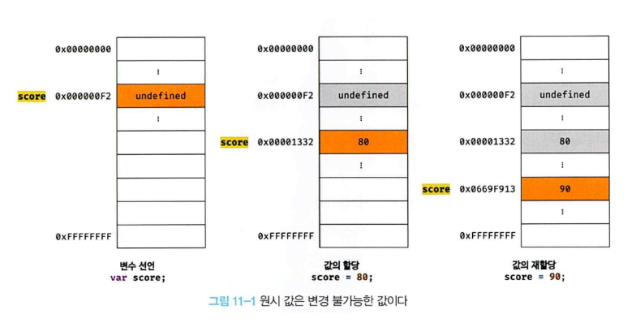
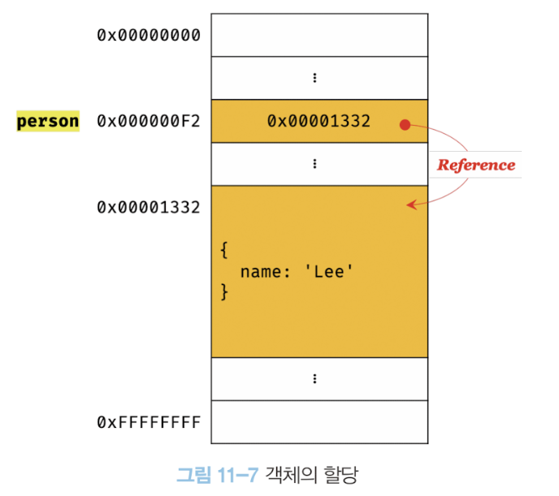

### 11장 원시 값과 객체의 비교

자바스크립트가 제공하는 7가지 데이터 타입은 크게 원시타입과 객체 타입으로 구분할 수 있다. 원시 타입과 객체 타입은 크게 세 가지 측면에서 다르다.

- 원시 타입의 값, 즉 원시 값은 변경 불가능한 값이다. 이에 비해 객체 타입의 값, 즉 객체는 변경 가능한 값이다.

- 원시 값을 변수에 할당하면 변수에는 실제 값이 저장된다. 이에 비해 객체를 변수에 할당하면 변수에는 참조 값이 저장된다.

- 원시 값을 갖는 변수에 할당하면 원본의 원시 값이 복사되어 전달된다. 이를 값에 의한 전달이라 한다. 이에 비해 객체를 가리키는 변수를 다른 변수에 할당하면 원본의 참조 값이 복사되어 전될다. 이를 참조에 의한 전달이라 한다.

#### 11.1 원시 값

##### 11.1.1 변경 불가능한 값

**원시 타입의 값, 즉 원시 값은 변경 불가능한 값이다.**
값을 변경할 수 없다는 것이 무엇을 말하는지 생각해보자. 먼저 변수와 값은 구분해서 생각해야 한다. 변수는 하나의 값을 저장하기 위해 확보한 메모리 공간 자체 또는 메모리 공간을 식별하기 위해 붙은 이름이다. **변경 불가능하다는 것은 변수가 아니라 값에 대한 진술이다.**

즉, "원시 값은 변경 불가능하다"는 말은 원시 값 자체를 변경할 수 없다는 것이지 변수 값을 변경할 수 없다는 것이 아니다. 변수는 언제든지 재할당을 통해 값을 교체할 수 있다.

변수의 상대 개념인 상수는 재할당이 금지된 변수를 말한다. 상수는 재할당이 금지된 변수일 뿐이다.

원시 값은 변경 불가능한 값, 즉 읽기 전용값이다. 원시 값은 어떤 일이 있어도 불변한다. 이러한 원시 값의 특성은 데이터의 신뢰성을 보장한다.

<p align="center"></img></p>

변수가 참조하던 메모리 공간의 주소가 변경된 이유는 변수에 할당된 원시 값이 변경 불가능한 값이기 때문이다. 따라서 변수 값을 변경하기 위해 원시 값을 재할당하면 새로운 메모리 공간을 확보하고 재할당한 값을 저장한 후, 변수가 참조하던 메모리 공간의 주소를 변경한다. 값의 이러한 특성을 **불변성**이라고 한다.

**불변성을 갖는 원시 값을 할당한 변수는 재할당 이외에 변수 값을 변경할 수 있는 방법이 없다.**

#### 11.1.2 문자열과 불변성

원시 값을 저장하려면 먼저 확보해야 하는 메모리 공간의 크기를 결정해야 한다. 이를 위해 원시 타입별로 크기가 미리 정해져 있다고 했다. 단, ECMAScript 사양에 문자열 타입과 숫자 타입 이외의 원시 타입은 크기를 명확히 구정하고 있지는 않아서 브라우저 제조사의 구현에 따라 원시 타입의 크기가 다를 수 있다.

원시 값인 문자열은 다른 원시 값과는 다른 독특한 특징이 있다. 문자열은 0개 이상의 문자로 이뤄진 집합을 말하며, 1개의 문자는 2바이트의 메모리 공간에 저장된다. 따라서 문자열은 몇 개의 문자열로 이뤄졌느냐에 따라 필요한 메모리 공간의 크기가 결정된다.

자바스크립트의 문자열은 원시 타입이며, 변경 불가능하다. 이것은 문자열이 생성된 이후에는 변경할 수 없음을 의미한다.

```
var str = 'string'

str[0]='S'

console.log(str) // string
```

#### 11.1.3 값에 의한 전달

```
var score = 80
var copy = score

score = 100

console.log(copy) // 80
```

이처럼 변수에 원시 값을 갖는 변수를 할당하면 할당받는 변수(copy)에는 할당되는 변수(score)의 원시 값이 복사되어 전달된다. 이를 **값에 의한 전달**이라 한다.

이때 score변수와 copy변수는 숫자 값 80을 갖는다는 점에서는 동일하다. 하지만 **score 변수와 copy 변수의 값은 다른 메모리 공간에 저장된 별개의 값이다.**

<p align="center"></img></p>

score 변수와 copy 변수의 값 80은 다른 메모리 공간에 저장된 별개의 값이라는 것에 주의하기 바란다. 따라서 score 변수의 값을 변경해도 copy 변수의 값에는 어떠한 영향을 주지 않는다.

엄격하게 표현하면 변수에는 값이 전달되는 것이 아니라 메모리 주소가 전달되기 때문에 오해가 있을 수도 있다. 이는 변수와 같은 식별자는 값이 아니라 메모리 주소를 기억하고 있기 때문이다.

값의 의한 절단은 사실은 값을 전달하는 것이 아니라 메모리 주소를 전달한다. 단 전달된 메모리 주소를 통해 메모리 공간에 접근하면 값을 참조할 수 있다.

**결국은 두 변수의 원시 값은 서로 다른 메로리 공간에 저장된 별개의 값이 되어 한쪽에서 재할당을 통해 변경하더라도 서로 간섭할 수 없다**는 것이다.

#### 11.2 객체

객체는 프로퍼티의 개수가 정해져 있지 않으며, 동적으로 추가되고 삭제할 수 있다. 또한 프로퍼티의 값에도 제약이 없다. 따라서 객체는 원시 값과 같이 확보해야 할 메모리 공간의 크기를 사전에 정해 둘 수 없다.

객체를 관리하는 방식이 원시 값과 비교해서 복잡하고 구현 방식도 브라우저 제조사마다 다를 수 있다. 객체를 생성하고 프로퍼티에 접근하는 것도 원시 값과 비교할 때 비용이 많이 드는 일이다.
따라서 객체는 원시 값과는 다른 방식으로 동작하도록 설계되어 있다.

> **자바스크립트 객체의 관리 방식**
>
> 자바스크립트 객체는 프로퍼티 키를 인덱스로 사용하는 해시 테이블이라고 생각할 수 있다. 대부분의 자바스크립트 엔진은 해시 테이블과 유사하지만 높은 성능을 위해 일반적인 해시 테이블보다 나은 방법으로 구현한다.
>
> 자바스크립트는 클래스 없이 객체를 생성할 수 있으며 객체가 생성된 이후라도 동적으로 프로퍼티와 메서드를 추가할 수 있다. 이는 사용하기 매우 편리하지만 성능 면에서는 이론적으로 클래스 기반 객체지향 프로그래밍 언어의 객체보다 생성과 프로퍼티 접근에 비용이 더 많이 드는 비효율적인 방식이다.  
> 따라서 V8 자바스크립트 엔진에서는 프로퍼티에 접근하기 위해 동적 탐색 대신 **히든 클래스**라는 방식을 사용해 C++ 객체의 프로퍼티에 접근하는 정도의 성능을 보장한다.
>
> - [V8 히든 클래스 이야기](https://engineering.linecorp.com/ko/blog/v8-hidden-class)

#### 11.2.1 변경 가능한 값

**객체(참조) 타입의 값, 즉 객체는 변경 가능한 값**이다. 먼저 객체를 할당하면 어떤 일이 일어나는지 살펴보자.

```
var person ={
    name: 'Lee'
};
```

<p align="center"></img></p>

원시 값을 할당한 변수는 원시 값 자체를 값으로 갖는다. 하지만 객체를 할당한 변수가 기억하는 메모리 주소를 통해 메모리 공간에 접근하면 **참조 값** 에 접근할 수 있다. 참조 값은 생성된 객체가 저장된 메모리 공간의 주소, 그 자체다.

**객체는 변경 가능한 값이다. 따라서 객체를 할당한 변수는 재할당 없이 객체를 직접 변경할 수 있다. 즉, 재할당 없이 프로퍼티를 동적으로 추가할 수도 있고 프로퍼티 값을 갱신할 수도 있으며 프로퍼티 자체를 삭제할 수도 있다.**

객체는 크기가 매우 클 수도 있고, 원시 값처럼 크기가 일정하지도 않으며, 프로퍼티 값이 객체일 수도 있어서 복사해서 생성하는 비용이 많이 든다. 다시 말해, 메모리의 효율적 소비가 어렵고 성능이 나빠진다.  
따라서 메모리를 효율적으로 사용하기 위해, 그리고 객체를 복사해 생성하는 비용을 절약하여 성능을 향상시키기 위해 객체는 변경 가능한 값으로 설계되어 있다.

객체는 이러한 구조적 단점에 따른 부작용이 있다. 그것은 원시 값과는 다르게 **여러 개의 식별자가 하나의 객체를 공유할 수 있다**는 것이다.

> **얕은 복사와 깊은 복사**  
> 객체를 프로퍼티 값으로 갖는 객체의 경우 얕은 복사는 한 단계까지만 복사하는 것을 말하고 깊은 복사는 객체에 중텁되어 있는 객체까지 모두 복사하는 것을 말한다.
>
> ```
> const o = { x: { y:  1 } }
>
> // 얕은 복사
> const c1 = {...o}
> console.log(c1===o) // false
> console.log(c1.x===o.x) // true
>
> // 깊은 복사
> const _ = require('lodash')
> const c2 = _.cloneDeep(o)
> console.log(c2===o)
> console.log(c2.x===o.x)
> ```
>
> 얕은 복사와 깊은 복사로 생성된 객체는 원본과는 다른 객체다. 즉, 원본과 복사본은 참조 값이 다른 별개의 객체다. 하지만 앝은 복사는 객체에 중첩되어 있는 객체의 경우 참조 값을 복사하고 깇은 복사는 객체에 중첩되어 있는 객체까지 모두 복사해서 원시 값처럼 완전한 복사본을 만든다는 차이가 있다.

#### 11.2.1 참조에 의한 전달

여러 개의 식별자가 하나의 객체를 공유할 수 있다는 것이 무엇을 의미하는지, 이로 인해 어떤 부작용이 발생하는 확인하자.

```
var person = {
    name: 'Lee'
}

// 참조값을 복사(얕은 복사)
var copy = person
```

객체를 가르키는 변수를 다른 변수에 할당하면 원본의 **참조 값이 복사되어 전달**된다. 이를 **참조에 의한 전달**이라 한다.

<p align="center"></img></p>

이때 원본 person과 사본 copy는 저장된 메모리 주소는 다르지만 동일한 참조 값을 갖는다. 다시 말해, **두 개의 식별자가 하나의 객체를 공유한다는 것을 의미한다**
