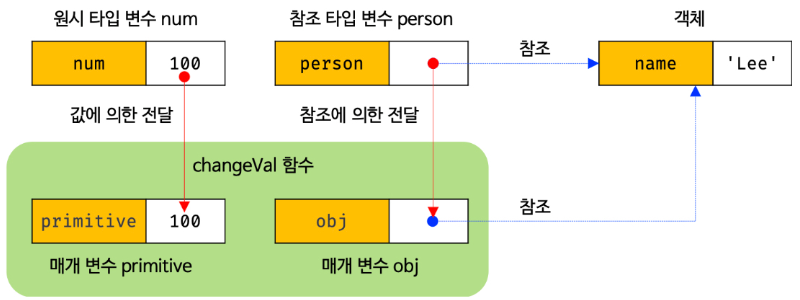

## 12장 함수

### 12.1 함수란?

프로그래밍 언어의 **함수는 일련의 과정을 문으로 구현하고 코드 블록으로 감싸서 하나의 실행 단위로 정의한 것이다.**

프로그래밍 언어의 함수도 입력을 받아서 출력을 내보낸다. 이때 함수 내부로 입력을 전달받는 변수를 **매개변수**, 입력을 **인수**, 출력을 **반환값**이라 한다.

함수는 **함수 정의**를 통해 생성한다.

<p align="center"></img></p>

### 12.2 함수를 사용하는 이유?

함수는 필요할 때 여러 번 호출할 수 있으므로 **코드의 재사용**이라는 측면에서 유용하다. 코드의 중복을 억제하고 재사용성을 높이는 함수는 유지보수의 편의성을 높이고 실수를 줄여 **코드의 신뢰성**을 높이는 효과가 있다. 또한 적절한 함수 이름은 함수의 내부 코드를 이해하지 않고도 함수의 역할을 파악할 수 있게 돕는다. 이는 **코드의 가독성**을 향상시킨다.

### 12.3 함수 리터럴

자바스크립트의 함수는 객체 타입의 값이다. 함수 리터럴은 function 키워드, 함수 이름, 매개 변수 목록, 함수 몸체로 구성된다. 리터럴은 값을 생성하기 위한 표기법이다. 따라서 함수 리터럴도 평가되어 생성하며, 이 값은 객체다. 즉 **함수는 객체다.**

함수는 객체지만 일반 객체와는 다르다. **일반 객체는 호출할 수 없지만 함수는 호출할 수 있다.**

### 12.4 함수 정의

함수 정의란 함수를 호출하기 이전에 인수를 전달받을 매개변수와 실행할 문들, 그리고 반환할 값을 지정하는 것을 말한다. 정의된 함수는 자바스크립트 엔진에 의해 평가되어 함수 객체가 된다.

<table style="border: 2px ">
  <tr style="font-weight: bold">
    <td>함수 정의 방식</td>
    <td>예시</td>
  </tr>
  <tr style>
    <td style="border-right: 1px inset">함수 선언문</td>
    <td>
    function add(x, y){<br> return x + y; <br>}
    </td>
  </tr>
  <tr>
    <td  style="border-right: 1px inset">심벌(symbol) 타입</td>
    <td>
        var add = function {<br> return x + y; <br>}
    </td>
  </tr>
  <tr style="border-bottom: 1px inset">
    <td  style="border-right: 1px inset">Function 생성자 함수</td>
    <td>var add = new Function('x', 'y', 'return x + y');</td>
  </tr>
    <tr style="border-bottom: 1px inset">
    <td  style="border-right: 1px inset">화살표 함수(ES6)</td>
    <td>var add = (x, y) => x + y;</td>
  </tr>
</table>
모두 함수 정의 방식은 함수를 정의한다는 면에서는 동일하다. 단, 미묘하지만 중요한 차이가 있다.

#### 12.4.1 함수 선언문

함수 선언문은 함수 리터럴과 형태가 동일하다. 단 함수 리터럴은 함수 이름을 생략할 수 있으나 **함수 선언문은 함수 이름을 생략할 수 없다.**

```
function (x,y){
    return x,y;
}
// SyntaxError: Function statements require a function name
```

**함수 선언문은 표현식이 아닌 문이다.** 크롬 개발자 도구의 콘솔에서 함수 선언문을 실행하면 완료 값 undefined가 출력된다.

5.6절에서 살펴보았듯이 표현식이 아닌 문은 변수에 할당할 수 없다. 함수 선언문도 표현식이 아닌 문이므로 변수에 할당할 수 없다. 하지만 다음 예제를 실행해보면 함수 선언문이 변수에 할당되는 것처럼 보인다.

```
var add = function add(x,y){
    return x + y;
}
```

이렇게 동작하는 이유는 자바스크립트 엔진이 코드의 문맥에 따라 동일한 함수 리터럴을 표현식이 아닌 문인 함수 선언문으로 해석하는 경우와 표현식인 문인 함수 리터럴 표현식으로 해석하는 경우가 있기 때문이다.

```
function foo() { console.log('foo')}
foo() // foo

(function bar(){ console.log('bar')} );
bar(); // RefferenceError: bar is not defined
```

위 예제에서 함수 선언문으로 생성된 foo는 호출할 수 있으나 함수 리터럴 표현식으로 생성된 bar는 호출할 수 없다.

"함수 리터럴"에서 함수 이름은 함수 몸체 내에서만 참조할 수 있는 식별자다라고 했다. 이는 함수 몸체 외부에서는 함수 이름으로 함수를 참조할 수 없으므로 함수 몸체 외부에서는 함수 이름으로 함수를 호출할 수 없다는 의미다. 즉 함수를 가르키는 식별자가 없다는 것과 마찬가지다. 따라서 위 예제의 bar함수는 호출할 수 없다.

<p align="center"></img></p>

함수 선언문으로 선언문으로 정의된 함수는 foo라는 이름으로 호출할 수 있었다. foo는 함수 몸체 내부에서만 유효한 식별자인 함수 이름이므로 foo로 함수를 호출할 수 없어야 한다. 하지만 위 예제에서는 식별자 foo를 선언한 적도 없고 할당한 적도 없다. 결론부터 말하자면 foo는 자바스크립트 엔진이 암묵적으로 생성한 식별자다.

<p align="center"></img></p>

자바스크립트 엔진은 함수 선언문을 해석해 함수 객체를 생성한다. 따라서 **자바스크립트 엔진은 생성된 함수 호출하기 위해 함수 이름과 동일한 이름의 식별자를 암묵적으로 생성하고, 거기에 함수 객체를 할당한다.**

**함수는 함수이름으로 호출하는 것이 아니라 함수 객체를 가르키는 식별자로 호출한다.**

#### 12.4.2 함수 표현식

이처럼 값의 성질을 갖는 객체를 **일급 객체**라 한다. **자바스크립트의 함수 일급 객체다.** 함수가 일급 객체하는 것은 함수를 값처럼 자유롭게 사용할 수 있다는 의미다.

```
var add = function (x, y){
  return   x + y;
}

console.log(add(2, 5)); // 7
```

함수 선언문에서 살펴본 바와 같이 함수를 호출할 때는 함수 이름이 아니라 함수 객체를 가리키는 식별자를 사용해야 한다. 함수 이름은 함수 몸체 내부에서만 유효한 식별자이므로 함수 이름으로 함수를 호출할 수 없다.

```
var add = function foo(x, y){
  return x + y;
}

console.log(add(2,5)) // 7

console.log(foo(2,5)) // ReferenceError: foo is not defined
```

#### 12.4.3 함수 생성 시점과 함수 호이스팅

```
console.dir(add); // f add(x, y)
console.dir(sub); // undefined

console.log(add(2, 5)) // 7
console.log(sub(2, 5)) // undefined

function add(x, y){
  return x + y;
}

var sub = function(x, y){
  retrun x- y;
}
```

위 예제와 같이 함수 선언문으로 정의한 함수는 함수 선언문 이전에 호출할 수 있다. 그러나 함수 표현식으로 정의한 함수는 함수 표현식 이전에 호출할 수 있다. 이는 **함수 선언문으로 정의한 함수와 함수 표현식으로 정의한 함수의 생성 시점이 다르기 때문이다.**

함수 호이스팅과 변수 호이스팅은 미묘한 차이가 있다. var 키워드를 사용한 변수 선언문과 함수 선언문은 런타임 이전에 자바스크립트 엔진에 의해 먼저 실행되어 식별자를 생성한다는 점에서 동일하다. 하지만 var 키워드로 선언된 변수는 undefined로 초기화되고, 함수 선언문을 통해 암묵적으로 생성된 식별자는 함수 객체로 초기화된다.

함수 표현식은 변수에 할당되는 값이 함수 리터럴인 문이다. 따라서 함수 표현식은 변수 선언문과 변수 할당문을 한 번에 기술한 축약 표현과 동일하게 동작한다. 변수 선언은 런타임 이전에 실행되어 undefined로 초기화되지만 **변수 할당문의 값은 할당문이 실행되는 시점, 즉 런타임에 평가되므로 함수 표현식의 함수 리터럴도 할당문이 실행되는 시점에 평가되어 함수 객체가 된다.**

따라서 **함수 표현식으로 함수를 정의하면 하수 호이스팅이 발생하는 것이 아니라 변수 호이스팅이 발생한다.**

<p align="center"></img></p>

#### 12.4.4 Function 생성자 함수

자바스크립트가 기본 제공하는 빌트인 함수인 Function 생성자 함수에 매개변수 목록과 함수 몸체를 문자열로 전달하면서 new 연산자와 함께 호출하면 함수 객체를 생성해서 반환한다.

```
var add = new Function('x', 'y', 'return x + y');

console.log(add(2, 5));
```

Function 생성자 함수로 함수를 생성하는 방식은 일반적이지 않으며 바람직하지도 않다. Function 생성자 함수로 생성한 함수는 클로저(closer)를 생성하지 않는 등, 함수 선언문이나 함수 표현식으로 생성한 함수와 다르게 동작한다.

#### 12.4.5 화살표 함수

화살표 함수는 function 키워드 대신 화살표 =>를 사용해 좀 더 간략한 방법으로 함수를 선언할 수 있다.

```
const add = (x,y) => x + y
console.log(add(2, 5))
```

화살표 함수는 기존의 함수 선언문 또는 함수 표현식을 완전히 대체하기 위해 디자인된 것은 아니다. 화살표 함수는 기존의 함수보다 표현만 간략한 것이 아니라 내부 동작 또한 간략화되어 있다.

화살표 함수는 생성자 함수로 사용할 수 없으며, 기존의 함수와 this 바인딩 방식이 다르고, prototype 프로퍼티가 없으며 arguments 객체를 생성하지 않는다.

### 12.5 함수 호출

함수를 호출하면 현재의 실행 흐름을 중단하고 호출된 함수로 실행 흐름을 옮긴다.
이때 매개변수에 인수가 순서대로 할당되고 함수 몸체의 문들이 실행되기 시작한다.

#### 12.5.1 매개변수와 인수

함수를 실행하기 위해 필요한 값을 함수 외부에서 함수 내부로 전달할 필요가 있는 경우, 매개변수를 통해 인수를 전달한다. 인수는 값으로 평가될 수 있는 표현식이어야 한다.

매개변수는 함수를 정의할 때 선언하며, 함수 몸체 내부에서 변수와 동일하게 취급된다. 즉, 함수가 호출되면 함수 몸체 내에서 암묵적으로 매개변수가 생성되고 일반 변수와 마찬가지로 undefined로 초기화된 이후 인수가 순서대로 할당된다.

함수는 매개변수의 개수와 인수의 개수가 일치하는지 체크하지 않는다. 즉, 함수를 호출할 때 매개변수의 개수만큼 인수를 전달하는 것이 일반적이지만, 그렇지 않은 경우에도 에러가 발생하지는 않는다. 인수가 부족해 인수가 할당되지 않은 매개변수의 값은 undefined다.

매개변수보다 인수가 더 많은 경우 초과된 인수는 무시된다.

```
function add(x, y){
  return x + y;
}

console.log(add(2)) // NaN
console.log(add(2,5,10)) // 7
```

사실 초과된 인수가 그냥 버려지는 것은 아니다. 모든 인수는 암묵적으로 arguments 객체의 프로퍼티로 보관된다.

#### 12.5.2 인수 확인

- 자바스크립트 함수는 매개변수와 인수의 개수가 일치하는지 확인하지 않는다.
- 자바스크립트는 동적 타입 언어다. 따라서 자바스크립트 함수는 매개변수의 타입을 사전에 지정할 수 없다.

따라서, 자바스크립트의 경우 함수를 정의할 때 적절한 인수가 전달되었는지 확인할 필요가 있다.

#### 12.5.3 매개변수의 최대 개수

함수의 매개변수는 코드를 이해하는 데 방해되는 요소이므로 이상적인 매개변수 개수는 0개이며 적을수록 좋다. 매개변수의 개수가 많다는 것은 함수가 여러 가지 일을 한다는 증거이므로 바람직하지 않다. **이상적인 함수는 한 가지 일만 해야 하며 가급적 작게 만들어야 한다.**

따라사 매개변수는 최대 3개 이상을 넘지 않는 것을 권장한다. 만약 그 이상의 매개변수가 필요하다면 하나의 매개변수를 선언하고 객체를 인수로 전달하는 것이 유리하다.

#### 12.5.4 반환문

함수는 return 키워드와 표현식(반환값)으로 이뤄진 반환문을 사용해 실행 결과를 함수 외부로 반환할 수 있다.

반환문은 두가지 역할은 한다.

- 반환문은 함수의 실행을 중단하고 함수 몸체를 빠져나간다.
- 반환문은 return 키워드 뒤에 오는 표현식을 평가해 반환한다. return 키워드 뒤에 반환값으로 사용할 표현식을 명시적으로 지정하지 않으면 undefined가 반환된다.

### 12.6 참조에 의한 전달과 외부 상태의 변경

함수의 매개변수도 함수 몸체 내부에서 변수와 동일하게 취급되므로 매개변수 또한 타입에 따라 값에 의한 전달, 참조에 의한 전달 방식을 그대로 따른다.

```
function changeVal(primitive, obj){
  primitive += 100;
  obj.name = "Kim";
}

var num = 100;
var person = { name: 'Lee'}

changeVal(num,person)

console.log(num); // 100
console.log(person); // {name: "Kim"}
```

원시 타입 인수를 전달받은 매개변수 primitive의 경우, 원시 값은 변경 불가능한 값이므로 직접 변경할 수 없기 때문에 재할당을 통해 할당된 원시 값을 새로운 원시 값으로 교체했고, 객체 타입 인수를 전달받은 매개변수 obj의 경우, 객체는 변경 가능한 값이므로 직접 변경할 수 있기 때문에 재할당 없이 직접 할당된 객체를 변경했다.

<p align="center"></img></p>

이처럼 함수가 외부 상태를 변경하면 상태 변화흫 추적하기 어려워진다. 이는 코드의 복잡성을 증가시키고 가독성을 해치는 원인이 된다. 이러한 현상은 객체가 변경할 수 있는 값이며, 참조에 의한 전달 방식으로 동작하기 때문에 발생하는 부작용이다.

이러한 문제의 해결 방법 중 하나는 객체를 불변 객체로 만들어 사용하는 것이다. 객체의 복사본을 새롭게 생성하는 비용은 들지만 객체를 마치 원시 값처럼 변경 불가능한 값으로 동작하게 만드는 것이다.

### 12.7 다양한 함수의 형태

#### 12.7.1 즉시 실행 함수

함수 정의와 동시에 즉시 호출되는 함수를 즉시 실행 함수라고 한다. 즉시 실행 함수는 단 한 번만 호출되며 다시 호출할 수 없다.

```
(function(){
  var a =3;
  var b =5;
  return a*b;
}());
```

즉시 실행 함수는 함수 이름이 없는 익명 함수를 사용하는 것이 일반적이지만, 기명 즉시 실행 함수도 사용할 수 있다.

즉시 실행 함수는 반드시 그룹 연산자 (...)로 감싸야 한다.

#### 12.7.2 재귀 함수

함수가 자기 자신을 호출하는 것을 재귀 호출이라 한다. 재귀 함수는 자기 자신을 호춯하는 행위, 즉 재귀 호출을 수행하는 함수를 말한다.

재귀 함수는 자신을 무한 재귀 호출한다. 따라서 재귀 함수 내에는 재귀 호출을 멈출 수 있는 **탈출 조건**을 반드시 만들어야 한다.

#### 12.7.3 중첩 함수

함수 내부에 정의된 함수를 중첩 함수 또는 내부 함수라 한다. 그리고 중첩 함수를 포함하는 함수는 외부 함수라 부른다. 중첩 함수는 외부 함수 내부에서만 호출할 수 있다. 일반적으로 중첩 함수는 자신을 포함하는 외부 함수를 돕는 헬퍼 함수의 역할을 한다.

```
function outer(){
  var x =1;

  function inner(){
    var y = 2;
    console.log(x + y); // 3
  }

  inner();
}
outer();
```

ES6부터 함수 정의는 문이 위치할 수 있는 문맥이라면 어디든지 가능하다.

단, 호이스팅으로 인해 혼란이 발생할 수 있으므로 if 문이나 for문 등의 코드 블록에서 함수 선언문을 통해 함수를 정의하는 것은 바람직하지 않다. 중첩 함수는 스코프와 클로저에 깊은 관련이 있다.

#### 12.7.4 콜백 함수

```
function repeat(n, f){
  for(var i =0; i< n ; i++){
    f(i);
  }
}

var logAll = function(i){
  console.log(i)
}

repeat(5, logAll); // 0 1 2 3 4

var logOdds = function(i){
  if (i%2) console.log(i)
}

repeat(5, logOdds); // 1 3
```

이처럼 **함수의 매개변수를 통해 다른 함수의 내부로 전달되는 함수를 콜백 함수라고 하며, 매개변수를 통해 함수의 외부에서 콜백 함수를 전달받은 함수를 고차 함수라고 한다.**

중첩 함수가 외부 함수를 돕는 헬퍼 함수의 역할을 하는 것처럼 콜백 함수도 고차 함수에 전달되어 헬퍼 함수의 역할을 한다. 단, 중첩 함수는 고정되어 있어서 교체하기 곤란하지만 콜백 함수는 함수 외부에서 고차 함수 내부로 주입하기 때문에 자유롭게 교체할 수 있다는 장점이 있다. 즉, **고차 함수는 콜백 함수를 자긴의 일부분으로 합성한다.**

**고차 함수는 매개변수를 통해 전달받은 콜백 함수의 호출 시점을 결정해서 호출한다.** 다시 말해, **콜백 함수는 고차 함수에 의해 호출되며 이때 고차 함수는 필요에 따라 콜백 함수에 인수를 전달할 수 있다.** 따라서 고차 함수에 콜백 함수를 전달할 때 콜백 함수를 호출하지 않고 함수 자체를 전달해야 한다.

콜백 함수는 함수형 프로그래밍 패러다임뿐만 아니라 비동기 처리(이벤트 처리, Ajax 통신, 타이머 함수 등)에 활용되는 중요한 패턴이다.

#### 12.7.5 순수 함수와 비순수 함수

함수형 프로그래밍에서는 어떤 외부 상태에 의존하지도 않고 변경하지도 않는, 즉 부수 효과가 없는 함수를 순수 함수라 하고, 외부 상태에 의존하거나 외부 상태를 변경하는, 즉 부수 효과가 있는 함수를 비순수 함수라고 한다.

순수 함수는 동일한 인수가 전달되면 언제나 동일한 값을 반환하는 함수다. 즉, 순수 함수는 어떤 외부 상태에도 의존하지 않고 오직 매개변수를 통해 함수 내부로 전달된 인수에게만 의존해 값을 생성해 반환한다.

즉, 순수 함수는 어떤 외부 상태에도 의존하지 않으며 외부 상태를 변경하지도 않는 함수다.

```
var count = 0;

// 순수 함수 increase는 동일한 인수가 전달되면 언제나 동일한 값을 반환한다.
function increase(n){
  return ++n ;
}

// 순수 함수가 반환한 결과값을 변수에 재할당해서 상태를 변경
count = increase(count);
console.log(count)
```

반대로 함수의 외부 상태에 따라 반환값이 달라지는 함수, 다시 말해 외부 상태에 의존하는 함수를 비순수 함수라고 한다.

비순수 함수는 외부 상태에 의존하거나 외부 상태를 변경하는 함수다.

```
var count = 0;

// 비순수 함수
function increase(){
  return ++count ;
}

// 비순수 함수는 외부 상태(count)를 변경하므로 상태 변화를 추적하기 어려워진다.
count = increase(count);
console.log(count)
```

함수형 프로그래밍은 순수 함수와 보조 함수의 조합을 통해 외부 상태를 변경하는 부수 효과를 최소화해서 불변성을 지향하는 프로그래밍 패러다임이다.
