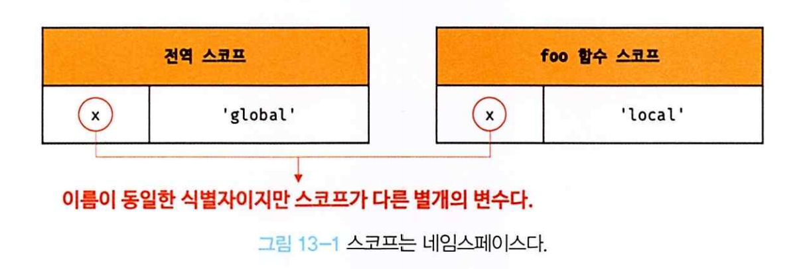

## 13장 스코프

### 13.1 스코프란?

**모든 식별자(변수 이름, 함수 이름, 클래스 이름 등) 자신이 선언된 위치에 의해 다른 코드가 식별자 자신을 참조할 수 있는 유효 범위가 결정된다. 이를 스코프라 한다. 즉, 스코프는 식별자가 유효한 범위를 말한다.**

```
var x="global"

function foo(){
    var x ='local';
    console.log(x);
}

foo();

console.log(x);
```

이때 자바스크립트 엔진은 이름이 같은 두 개의 변수 중에서 어떤 변수를 참조해야 할 것인지를 결정해야 한다. 이를 **식별자 결정**이라 한다. 자바스크립트 엔진은 스코프를 통해 어떤 변수를 참조해야 할 것인지 결정한다. 따라서 스코프란 자바스크립트 엔진이 **식별자를 검색할 때 사용하는 규칙**이라고도 한다.

> **코드의 문맥과 환경**  
> "코드가 어디서 실행되며 주변에 어떤 코드가 있는지" 렉시컬 환경이라고 부른다. 즉, 코드의 문맥은 렉시컬 환경으로 이뤄진다. 이를 구현한 것이 "실행 컨텍스트"이며, 모든 코드는 실행 컨텍스트에서 평가되고 실행된다. 스코프는 실행 컨텍스트와 깊은 관련이 있다.

위에 코드에서 두 개의 x변수는 식별자 이름이 동일하지만 자신이 유효한 범위, 즉 스코프가 다른 별개의 변수다.

<p align="center"></img></p>

만약 스코프라는 개념이 없다면 같은 이름을 갖는 변수는 충돌을 일으키므로 프로그램 전체에서 하나밖에 사용할 수 없다. 프로그래밍 언어에서는 스코프(유효 범위)를 통해 식별자인 변수 이름의 충돌을 방지하여 같은 이름의 변수를 사용할 수 있게 한다. 스코프 내에서는 식별자는 유일해야 하지만, 다른 스코프에는 같은 이름의 식별자를 사용할 수 있다. 즉, 스코프는 네임스페이스다.

### 13.2 스코프의 종류

코드는 전역과 지역으로 구분할 수 있다.

<table align="center" width="500" border>
  <tr style="font-weight: bold">
    <td>구분</td>
    <td>설명</td>
    <td>스코프</td>
    <td>변수</td>
  </tr>
  <tr>
    <td>전역</td>
    <td>코드의 가장 바깥 영역</td>
    <td >전역 스코프 </td>
    <td>전역 변수 </td>
  </tr>
  <tr>
    <td>지역</td>
    <td>함수 몸체 내부</td>
    <td >지역 스코프 </td>
    <td>지역 변수 </td>
  </tr>
</table>

#### 13.2.1 전역과 전역 스코프

<p align="center"></img></p>

전역에 변수를 선언하면 전역 스코프를 갖는 전역 변수가 된다. **전역 변수는 어디서든지 참조할 수 있다**

#### 13.2.2 지역과 지역 스코프

지역이란 **함수 몸체 내부**를 말한다. 지역 변수는 자신이 선언된 지역과 하위 지역에서만 참조할 수 있다. 다시 말해, **지역 변수는 자신의 지역 스코프와 하위 지역 스코프에서 유효하다.**

### 13.3 스코프의 체인

함수는 중첩될 수 있으므로 함수의 지역 스코프도 중첩될 수 있다. 이는 **스코프가 함수의 중첩에 의해 계층적 구조를 갖는다**는 것을 의미한다.

<p align="center"></img></p>

이처럼 모든 스코프는 하나의 계층적 구조로 연결되먀, 모든 지역 스코프의 최상위 스코프는 전역 스코프다. 이렇게 스코프가 계층적으로 연결된 것을 **스코프 체인**이라 한다.

**변수를 참조할 때 자바스크립트 엔진은 스코프 체인을 통해 변수를 참조하는 코드의 스코프에서 시작하여 상위 스코프 방향으로 이동하며 선언된 변수를 검색한다.**

스코프 체인은 물리적인 실체가 존재한다. 자바스크립트 엔진은 코드를 실행하기에 앞서 위 그림과 유사한 자료구조인 렉시컬 환경을 실제로 생성한다.

#### 13.3.1 스코프 체인에 의한 변수 검색

자바스크립트 엔진은 스코프 체인을 따라 변수를 참조하는 코드의 스코프에서 시작해서 상위 스코프 방향으로 이동하며 선언된 변수를 검색한다. 절대 하위 스코프로 내려가면서 식별자를 검색하는 일은 없다. 이는 **상위 스코프에서 유효한 변수는 하위 스코프에서 자유롭게 참조할 수 있지만 하위 스코프에서 유효한 변수를 상위 스코프에서 참조할 수 없다**는 것을 의미한다.

#### 13.3.2 스코프 체인에 의한 함수 검색

함수도 식별자에 할당되기 때문에 스코프를 갖는다. 사실 함수는 식별자에 함수 객체가 할당된 것 외에는 일반 변수와 다를 바 없다. 따라서 스코프를 "변수를 검색할 때 사용하는 규칙"이라고 표현하기보다는 **"식별자를 검색하는 규칙"**이라고 표현하는 편이 적합하다.

### 13.4 함수 레벨 스코프

지역은 함수 몸체 내부를 말하고 지역은 지역 스코프를 만든다고 했다. 이는 **코드 블록이 아닌 함수에 의해서만 지역 스코프가 생성된다**는 의미다.

이러한 특성을 **블록 레벨 스코프**라 한다. 하지만**var 키워드로 선언된 변수를 오로지 함수의 코드 블록(함수 몸체)만을 지역 스코프로 인정한다**

```
var x = 1;
if(true){
    var x = 10
}

console,log(x); // 10
```

### 13.5 렉시컬 스코프

```
var x = 1;

function foo(){
    var x = 10;
    bar();
}

function bar(){
    console.log(x);
}

foo(); // 1
boo(); // 1
```

위 실행 결과는 bar 함수의 상위 스코프가 무엇인지에 따라 결정된다. 두 가지 패턴을 예측할 수 있다.

- 함수를 어디서 호출했는지에 따라 함수의 상위 스코프를 결정한다.
- 함수를 어디서 정의했는지에 따라 함수의 상위 스코프를 결정한다.

**자바스크립트는 렉시컬 스코프를 따르므로 함수를 어디서 호출했는지가 아니라 함수를 어디서 정의했는지에 따라 상위 스코프를 결정한다. 함수가 호출된 위치는 상위 스코프 결정에 어떠한 영향도 주지 않는다. 즉, 함수의 상위 스코프는 언제나 자신이 정의된 스코프다.**

**이처럼 함수의 상위 스코프는 함수 정의가 실행될 때 정적으로 결정된다, 함수 정의(함수 선언문 또는 함수 표현식)가 실행되어 생성된 함수 객체는 이렇게 결정된 상위 스코프를 기억한다. 함수가 호출될 때마다 함수의 상위 스코프를 참조할 필요가 있다.**
