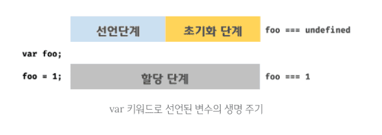
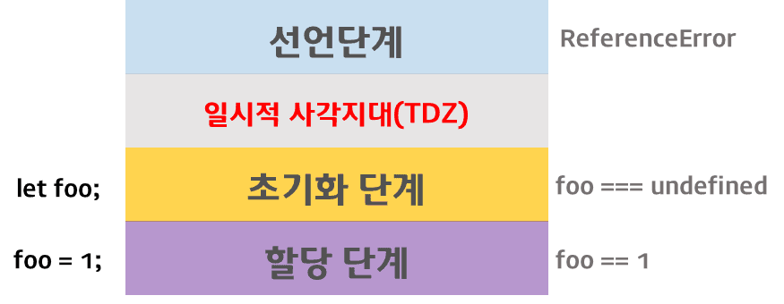

## 15장 let, const 키워드와 블록 레벨 스코프

### 15.1 var 키워드로 선언한 변수의 문제점

#### 15.1.1 변수 중복 선언 허용

```
var x = 1;
var y = 1;

var x = 100;

console.log(x); // 100
```

위 예제의 var키워드로 선언한 x변수와 y변수는 중복 선언되었다. 이처럼 var 키워드로 선언한 변수를 중복 선언하면 초기화문 유무에 따라 다르게 동작한다.

때문에 만약 동일한 이름의 변수가 이미 선언되어 있는 것을 모르고 변수를 중복 선언하면서 값까지 할당했다면 의도치 않게 먼저 선언된 변수 값이 변경되는 부작용이 발생한다.

#### 15.1.2 함수 레벨 스코프

var 키워드로 선언한 변수는 오로지 함수의 코드 블록만을 지역 스코프로 인정한다. 따라서 함수 외부에서 var키워드로 선언한 변수는 블록 내에서 선언해도 모두 전역 변수가 된다.

```
var i =10

for(var i =0; i<5; i++){
    console.log(i) // 1 2 3 4 5
}

// 의도치 않게 i 변수의 값이 변경되었다.
console.log(i) // 5
```

함수 레벨 스코프는 전역 변수를 남발할 가능성을 높인다. 이로 인해 의도치 않게 전역 변수가 중복 선언되는 경우가 발생한다.

#### 15.1.3 변수 호이스팅

var 키워드로 변수를 선언하면 변수 호이스팅에 의해 변수 선언문이 스코프의 선두로 끌어 올려진 것처럼 동작한다. 즉, 변수 호이스팅에 의해 var 키워드로 선언한 변수는 변수 선언문 이전에 참조할 수 있다.

변수 선언문 이전에 변수를 참조하는 것은 변수 호이스팅에 의해 에러를 발생시키지는 않지만 프로그램 흐름상 맞지 않을뿐더러 가독성을 떨어뜨리고 오류를 발생시킬 여지를 남긴다.

### 15.2 let 키워드

앞에서 살펴본 var 키워드의 단점을 보완하기 위해 ES6에서는 새로운 변수 선언 키워드인 let과 const를 도입했다.

#### 15.2.1 변수 중복 선언 금지

let 키워드는 var과 달리, 이름이 같은 변수를 중복 선언하면 문법 에러(Syntax Error)가 발생한다.

#### 15.2.2 블록 레벨 스코프

let 키워드로 선언한 변수는 모든 코드 블록을 지역 스코프로 인정하는 블록 레벨 스코프를 따른다.

```
let foo = 1; // 전역 변수
{
    let foo = 2; // 지역 변수
    let bar = 3; // 지역 변수
}

console.log(foo); // 1
console.log(bar); // ReferenceError: bar is not defined
```

#### 15.2.3 변수 호이스팅

var 키워드로 선언한 변수와 달리 let키워드로 선언한 변수는 변수 호이스팅이 발생하지 않는 것처럼 동작한다.

```
console.log(foo) // ReferenceError: foo is not defined
let foo;
```

var 키워드로 선언한 변수는 런타임 이전에 자바스크립트 엔진에 의해 암묵적으로 "선언 단계"와 "초기화 단계"가 한번에 진행된다.

즉, 선언 단계에서 스코프에 변수 식별자를 등록해 자바스크립트 엔진에 변수의 존재를 알린다. 그리고 즉시 초기화 단계에서 undefined로 변수를 초기화한다. 따라서 선언문 이전에 변수에 접근해도 스코프에 변수가 존재하기 때문에 에러가 발생하지 않는다.

<p align="center"></img></p>

**let 키워드로 선언한 변수는 "선언 단계"와 "초기화 단계"가 분리되어 진행된다.** 즉, 런타임 이전에 자바스크립트 엔진에 의해 암묵적으로 선언 단계가 먼저 실행되지만 초기화 단계는 변수 선언문에 도달했을 때 실행된다.

만약 초기화 단계가 실행되기 이전에 변수에 접근하려고 하면 참조 에러가 발생한다. let 키워드로 선언한 변수는 스코프의 시작 지점부터 초기화 단계 시작 지점까지 변수를 참조할 수 없다. 스코프의 시작 지점부터 초기화 시작 지점까지 변수를 참조할 수 없는 구간을 **일시적 사각지대**라고 부른다.

<p align="center"></img></p>

#### 15.2.4 전역 객체와 let

var 키워드로 선언한 전역 변수와 전역 함수, 그리고 선언하지 않은 변수에 값을 할당한 암묵적 전역은 전역 객체 window의 프로퍼티가 된다. 전역 객체의 프로퍼티를 참조할 때 window를 생략할 수 있다.

```
var x = 1;
y = 2;
function foo() {}

// var 키워드로 선언한 전역 변수는 전역 객체 window의 프로퍼티다.
console.log(window.x) //1

// 함수 선언문으로 정의한 전역 함수는 전역 객체 window의 프로퍼티다.
console.log(window.foo); // f foo() {}
```

let 키워드로 선언한 전역 변수는 전역 객체의 프로퍼티가 아니다. 즉, window.foo와 같이 접근할 수 없다. let 전역 변수는 보이지 않는 개념적인 블록 내에 존재한게 된다.

### 15.3 const 키워드

const 키워드는 상수를 선언하기 위해 사용한다. 하지만 반드시 상수만을 위해 사용하지는 않는다. 이에 대해서는 후반부에 설명한다.

#### 15.3.1 선언과 초기화

**const 키워드로 선언한 변수는 반드시 선언과 동시에 초기화해야 한다.**

```
const foo; // SyntaxError: Missing initializer in const declaration
```

const 키워드로 선언한 변수는 let키워드로 선언한 변수와 마찬가지로 블록 레벨 스코프를 가지며, 변수 호이스팅이 발생하지 않는 것 처럼 동작한다.

#### 15.3.2 재할당 금지

**const 키워드로 선언한 변수는 재할당이 금지된다.**

#### 15.3.3 상수

const 키워드로 선언한 변수에 원시 값을 할당한 경우 변수 값을 변경할 수 없다. 원시 값은 변경 불가능한 값이므로 재할당 없이 값을 변경할 수 있는 방법이 없기 때문이다. 이러한 특징을 이용해 const 키워드를 상수를 표현하는 데 사용하기도 한다.

변수의 상대 개념인 **상수는 재할당이 금지된 변수를 말한다.** 상수도 값을 저장하기 위한 메모리 공간이 필요하므로 변수라고 할 수 있다. 단, 변수는 언제든지 재할당을 통해 변수 값을 변경할 수 있지만 상수는 재할당이 금지된다.

const 키워드로 선언된 변수는 재할당이 금지된다. **const 키워드로 선언된 변수에 원시 값을 할당한 경우 원시 값은 변경할 수 없는 값이고 const 키워드에 의해 재할당이 금지되므로 할당된 값을 변경할 수 있는 방법은 없다.**

#### 15.3.4 const 키워드와 객체

const 키워드로 선언된 변수에 원시 값을 할당한 경우 값을 변경할 수 없다. 하지만 **const 키워드로 선언된 변수에 객체를 할당한 경우 값을 변경할 수 있다.** 변경 불가능한 값인 원시 값은 재할당 없이 변경(교체)할 수 있는 방법이 없지만 변경 가능한 값인 객체는 재할당 없이도 직접 변경이 가능하기 때문이다.

```
const person = {
    name: 'Lee'
}

person.name = 'Kim'

console.log(person) // {name: "Kim"}
```

**const 키워드는 재할당을 금지할 뿐 "불변"을 의미하지는 않는다.**

### 15.4 var vs. let vs. const

변수 선언에는 기본적으로 const를 사용하고 let은 재할당이 필요한 경우에 한정해 사용하는 것이 좋다. const 키워드를 사용하면 의도치 않은 재할당을 방지하기 때문에 좀 더 안전하다.

- ES6를 사용한다면 var키워드는 사용하지 않는다.
- 재할당이 필요한 경우에 한정해 let키워드를 사용한다. 이때 변수의 스코프는 최대한 좁게 만든다.
- 변경이 발생하지 않고 읽기 전용으로 사용하는 원시 값과 객체에는 const 키워드를 사용한다. const 키워드는 재할당을 금지하므로 var, let 키워드보다 안전하다.

변수를 선언하는 시점에는 재할당이 필요할지 잘 모르는 경우가 많다. 따라서 변수를 선언할 때는 일단 const 키워드를 사용하자. 반드시 재할당이 필요하다면 그때 const 키워드를 let 키워드로 변경해도 늦지 않다.
