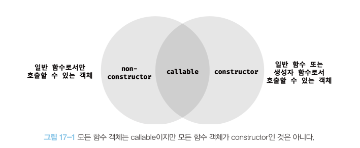

## 17장 생성자 함수에 의한 객체 생성

이번 장에서는 다양한 객체 생성 방식 중에서 생성자 함수를 사용하여 객체를 생성하는 방식을 살펴본다. 그리고 객체 리터럴을 사용하여 객체를 생성하는 방식과 생성자 함수를 사용하여 객체를 생성하는 방식과의 장단점을 살펴보자.

### 17.1 Object 생성자 함수

new 연산자와 함께 Object 생성자 함수를 호출하면 빈 객체를 생성하여 반환한다. 빈 객체를 생성한 이후 프로퍼티 또는 메서드를 추가하여 객체를 완성할 수 있다.

```
const person = new Object();

person.name = "Lee";
person.sayHello = function () {
  console.log("Hi My name is " + this.name);
};

console.log(person); // { name: 'Lee', sayHello: [Function (anonymous)] }
person.sayHello(); // Hi My name is Lee
```

반드시 Object 생성자 함수를 사용해 빈 객체를 생성해야 하는 것은 아니다. 객체를 생성하는 방법은 객체 리터럴을 사용하는 것이 더 간편하다. Object 생성자 함수를 사용해 객체를 생성하는 방식은 특별한 이유가 없다면 그다지 유용해 보이지 않는다.

### 17.2 생성자 함수

#### 17.2.1 객체 리터럴에 의한 객체 생성 방식의 문제점

객체 리터럴에 의한 객체 생성 방식은 직관적이고 간편하다. 하지만 객체 리터럴에 의한 객체 생성 방식은 단 하나의 객체만 생성한다. 따라서 동일한 프로퍼티를 갖는 객체를 여러 개 생성해야 하는 경우 매번 같은 프로퍼티를 기술해야 하기 때문에 비효율적이다.

#### 17.2.2 생성자 함수에 의한 객체 생성 방식의 장점

생성자 함수에 희한 객체 생성 방식은 마치 객체를 생성하기 위한 템플릿처럼 생성자 함수를 사용하여 프로퍼티 구조가 동일한 객체 여러 개를 간편하게 생성할 수 있다.

```
function Circle(radius) {
  this.radius = radius;
  this.getDiameter = function () {
    return 2 * this.radius;
  };
}

const circle1 = new Circle(5);
const circle2 = new Circle(10);

console.log(circle1.getDiameter()); // 10
console.log(circle2.getDiameter()); // 20
```

> **this**  
> this는 객체 자신의 프로퍼티나 메서드를 참조하기 위한 자기 참조 변수다. **this가 가르키는 값, 즉 this바인딩은 함수 호출 방식에 따라 동적으로 결정된다.**

<table width="500" border align="center" >
    <tr style="font-weight: bold; background-color: #ccc;">
        <td>함수 호출 방식</td>
        <td>this가 가르키는 값(this 바인딩)</td>
    </tr>
    <tr>
        <td>일반 함수로서 호출</td>
        <td>전역 객체</td>
    </tr>
    <tr>
        <td>메서드로서 호출</td>
        <td>메서드를 호출한 객체(마침표 앞의 객체)</td>
    </tr>
    <tr>
        <td>생성자 함수로서 호출</td>
        <td>생성자 함수가(미래에) 생성할 인스턴스</td>
    </tr>
</table>

생성자 함수는 이름 그대로 객체(인스턴스)를 생성하는 함수다. 하지만 자바와 같은 클래스 기반 객체지향 언어의 생성자와는 다르게 그 형식이 정해져 있는 것이 아니라 일반 함수와 동일한 방법으로 생성자 함수를 정의하고 **new 연산자와 함께 호출하면 해당 함수는 생성자 함수로 동작하다.**

```
const circle3 = Circle(15);

console.log(circle3); // undefined

// 일반 함수로 호출된 Circle 내의 this는 전역 객체를 가르킨다.
console.log(radius); // 15
```

#### 17.2.3 생성자 함수의 인스턴스 생성 과정

생성자 함수의 역할은 프로퍼티 구조가 동일한 인스턴스를 생성하기 위한 템플릿(클래스)으로서 동작하여 **인스턴스를 생성**하는 것과 **생성된 인스턴스를 초기화(인스턴스 프로퍼티 추가 및 초기값 할당)** 하는 것이다. 생성자 함수가 인스턴스를 생성하는 것은 필수이고, 생성된 인스턴스를 초기화하는 것은 옵션이다.

자바스크립트 엔진은 암묵적인 처리를 통해 인스턴스를 생성하고 반환한다. new 연산자와 함께 생성자 함수를 호출하면 자바스크립트 엔진은 다음과 같은 과정을 거쳐 암묵적으로 인스턴스를 생성하고 인스턴스를 초기화한 후 암묵적으로 인스턴스를 반환한다.

<p style="color: green">1. 인스턴스 생성과 this 바인딩<p>

암묵적으로 빈 객체가 생성된다. 이 빈 객체가 바로 생성자 함수가 생성한 인스턴스다. 그리고 암묵적으로 생성된 빈 객체, 즉 인스턴스는 this에 바인딩된다. 생성자 함수 내부의 this가 생성자 함수가 생성할 인스턴스를 가르키는 이유가 바로 이것이다. 이 처리는 함수 몸체의 코드가 한 줄씩 실행되는 런타임 이전에 실행된다.

> **바인딩**  
> 바인딩이란 식별자와 값을 연결하는 과정을 의미한다. 예를 들어, 변수 선언은 변수 이름(식별자)과 확보된 메모리 공간의 주소를 바인딩하는 것이다. this 바인딩은 this(키워드로 분류되지만 식별자 역할을 한다.)와 this가 가르킬 객체를 바인딩하는 것이다.

```
function Circle(radius) {
  //  1. 암묵적으로 인스턴스가 생성되고 this에 바인딩된다.
  console.log(this); // Circle {}

  this.radius = radius;
  this.getDiameter = function () {
    return 2 * this.radius;
  };
}
```

<p style="color: green">2. 인스턴스 초기화<p>

생성자 함수에 기술되어 있는 코드가 한 줄 씩 실행되어 this에 바인딩되어 있는 인스턴스를 초기화한다. 즉, this에 바인딩되어 있는 인스턴스에 프로퍼티나 메서드를 추가하고 생성자 함수가 인수로 전달받은 초기값을 인스턴스 프로퍼티에 할당하여 초기화하거나 고정값을 할당한다. 이 처리는 개발자가 기술한다.

```
function Circle(radius) {
  //  1. 암묵적으로 인스턴스가 생성되고 this에 바인딩된다.

  // 2. this에 바인딩되어 있는 인스턴스를 초기화한다.
  this.radius = radius;
  this.getDiameter = function () {
    return 2 * this.radius;
  };
}
```

<p style="color: green">3. 인스턴스 반환<p>
생성자 함수 내부의 모든 처리가 끝나면 완성된 인스턴스가 바인딩된 this가 암묵적으로 반환된다.

```
function Circle(radius) {
  //  1. 암묵적으로 인스턴스가 생성되고 this에 바인딩된다.

  // 2. this에 바인딩되어 있는 인스턴스를 초기화한다.
  this.radius = radius;
  this.getDiameter = function () {
    return 2 * this.radius;
  };

  // 3. 완성된 인스턴스가 바인딩된 this가 암묵적으로 반환된다.
}

// 인스턴스 생성. Circle 생성자 함수는 암묵적으로 this를 반환한다.
const circle = new Circle(1);
console.log(circle); // Circle { radius: 1, getDiameter: [Function (anonymous)] }
```

만약 this가 아닌 다른 객체를 명시적으로 반환하면 this가 반환되지 못하고 return 문에 명시한 객체가 반환된다.

하지만 명시적으로 원시 값을 반환하면 원시 값 반환은 무시되고 암묵적으로 this가 반환된다.

이처럼 생성자 함수 내부에서 명기적으로 this가 아닌 다른 값을 반환하는 것은 생성자 함수의 기본 동작을 훼손한다. 따라서 생성자 함수 내부에서 return 문을 반드시 생략해야 한다.

#### 17.2.4 내부 메서드 [ [ Call ] ] 과 [ [ Construct ] ]

함수 선언문 또는 함수 표현식으로 정의한 함수는 일반적인 함수로서 호출할 수 있는 것은 물론 생성자 함수로서 호출할 수 있다. 생성자 함수로서 호출한다는 것은 new 연산자와 함께 호출하여 객체를 생성하는 것을 의미한다.

함수는 객체이므로 일반 객체와 동일하게 동작할 수 있다. 함수 객체는 일반 객체가 가지고 있는 내부 슬롯과 메서드를 모두 가지고 있기 때문이다.

함수는 객체이지만 일반 객체와는 다르다. **일반 객체는 호출할 수 없지만 함수는 호출할 수 있다.** 때문에 함수 객체는 함수 객체만을 위한 [[Enviroment]], [[FormalParameters]] 등의 내부 슬롯과 [[Call]], [[Construct]] 같은 내부 메서드를 추가로 가지고 있다.

```
function foo() {}

// 일반적인 함수로서 호출: [[Call]] 호출
foo()

//생성자 함수로서 호출: [[Construct]] 호출
new foo()
```

호출할 수 없는 객체는 함수 객체가 아니므로 함수로서 기능하는 객체, 즉 함수 객체는 반드시 callable이어야 한다. 모든 함수 객체는 내부 메서드 [[Call]]을 갖고 있으므로 호출할 수 있다. 하지만 모든 함수 객체가 [[Construct]]를 갖는 것은 아니다.

<p align="center"></img></p>

#### 17.2.5 constructor와 non-constructor의 구분

자바스크립트 엔진은 함수 정의를 평가하여 함수 객체를 생성할 때 함수 정의 방식에 따라 함수를 constructor와 non-constructor로 구분한다.

- constructor: 함수 선언문, 함수 표현식, 클래스
- non-constructor: 메서드(ES6 메서드 축약 표현), 화살표 함수

#### 17.2.6 new 연산자

일반 함수와 생성자 함수에 특별한 차이는 없다. new 연산자와 함께 함수를 호출하면 해당 함수는 생성자 함수로 동작한다.

```
function Circle(radius) {
  this.radius = radius;
  this.getDiameter = function () {
    return 2 * this.radius;
  };
}
const circle = Circle(5);

console.log(circle); // undefined

console.log(radius); // 5

console.log(getDiameter()); // 10

circle.getDiameter(); // TypeError: Cannot read properties of undefined (reading 'getDiameter')
```

일반 함수와 생성자 함수에 특별한 형식적 차이는 없다. 따라서 생성자 함수는 일반적으로 첫 문자를 대문자로 기술하는 파스칼 케이스로 명명하여 일반 함수와 구별할 수 있도록 노력한다.

#### 17.2.7 new.target

생성자 함수가 new 연산자 없이 호출되는 것을 방지하기 위해 파스칼 케이스 컨벤션을 사용한다 하더라고 실수는 언제나 발생할 수 있다. 이러한 위험성을 회피하기 위해 ES6에서는 new.target을 지원한다.

함수 내부에서 new.target을 사용하면 new 연산자와 함께 생성자 함수로서 호출되었는지 확인할 수 있다. **new 연산자와 함께 생성자 함수로서 호출되면 함수 내부의 new.target은 함수 자신을 가르킨다. new 연산자 없이 일반 함수로서 호출된 함수 내부의 new.target은 undefined다.**

따라서 함수 내부에서 new.target을 사용하여 new 연산자와 생성자 함수로서 호출했는지 확인하여 그렇지 않은 경우 new 연산자와 함께 재귀 호출을 통해 생성자 함수로서 호출할 수 있다.

```
function Circle(radius) {
  if (!new.target) {
    return new Circle(radius);
  }
  this.radius = radius;
  this.getDiameter = function () {
    return 2 * this.radius;
  };
}
const circle = Circle(5);

console.log(circle.getDiameter()); // 10
```

> **스코프 세이프 생성자 패턴**  
> new.target은 ES6에서 도입된 최신 문법으로 IE에서는 지원하지 않는다. new.target을 사용할 수 없는 상황이라면 스코프 세이프 생성자 패턴을 사용할 수 있다.

```
function Circle(radius) {
  if (!(this instanceof Circle)) {
    return new Circle(radius);
  }
  this.radius = radius;
  this.getDiameter = function () {
    return 2 * this.radius;
  };
}
const circle = Circle(5);

console.log(circle.getDiameter()); // 10
```
