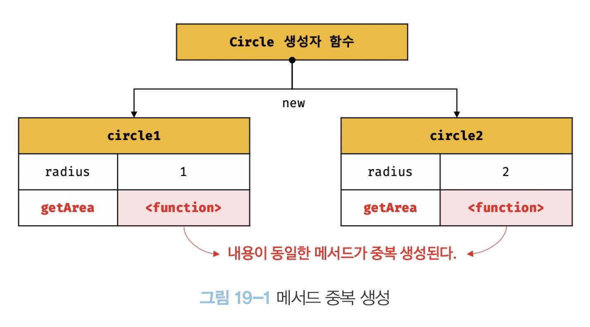

## 19장 프로토타입

자바스크립트는 클래스 기반 객체지향 프로그래밍 언어보다 효율적이며 더 강력한 객체지향 프로그래밍 능력을 지니고 있는 프로토타입 기반의 객체지향 프로그래밍 언어다.

자바스크립트는 객체 기반의 프로그래밍 언어이며 **자바스크립트를 이루고 있는 거의 "모든 것"이 객체다**

### 19.1 객체지향 프로그래밍

객체지향 프로그래밍은 프로그램은 전통적인 명령형 프로그래밍의 절차지향적 관점에서 벗어나 여러 개의 독립적 단위, 즉 객체의 집합으로 프로그램을 표현하려느 프로그래밍 패러다임을 말한다.

객체지향 프로그래밍은 실페를 프로그래밍에 접목하려는 시도에서 시작한다. 실체는 특징이나 성질을 나타내는 **속성**을 가지고 있고, 이를 통해 실체를 인식하거나 구별할 수 있다.

다양한 속성 중에서 프로그램에 필요한 속성만 간추려 내어 표현하는 것을 **추상화**라 한다.

**속성을 통해 여러 개의 값을 하나의 단위로 구성한 복합적인 자료구조**를 객체라하며, 객체지향 프로그래밍은 독립적인 객체의 집합으로 프로그램을 표현하려는 프로그래밍 패러다임이다.

따라서 객체는 **상태 데이터와 동작을 하나의 논리적인 단위로 묶은 복합적인 자료구조**라고 할 수 있다.

### 19.2 상속과 프로토타입

상속은 객체지향 프로그래밍의 핵심 개념으로 어떤 객체의 프로퍼티 또는 메서드를 다른 객체가 상속받아 그대로 사용할 수 있는 것을 말한다.

자바스크립트는 프로토타입을 기반으로 상속을 구현하여 불필요한 중복을 제거한다. 중복을 제거하는 방법은 기존의 코드를 적극적으로 재사용하는 것이다. 코드 재사용은 개발 비용을 현저히 줄일 수 있는 잠재력이 있으므로 매우 중요하다.

생성자 함수는 동일한 프로퍼티(메서드 포함) 구조를 갖는 객체를 여러 개 생성할 때 유용하다. 하지만 생성자 함수는 문제가 있다.

```
function Circle(radius) {
  this.radius = radius;
  this.getArea = function () {
    return Math.PI * this.radius ** 2;
  };
}

const circle1 = new Circle(1);
const circle2 = new Circle(2);

console.log(circle1.getArea === circle2.getArea);// false
console.log(circle1.getArea()); // 3.141592653589793
console.log(circle2.getArea()); // 12.566370614359172
```

<p align="center"></img></p>

동일한 생성자 함수에 의해 생성된 모든 인스턴스가 동일한 메서드를 중복 소유하는 것은 메모리를 불필요하게 낭비한다. 또한 인스턴스를 생성할 때 마다 메서드를 생성하므로 퍼포먼스에도 악영향을 준다.

상속을 통해 불필요한 중복을 제거해보자. **자바스크립트는 프로토타입을 기반으로 상속을 구현한다.**

```
function Circle(radius) {
  this.radius = radius;
}

Circle.prototype.getArea = function () {
  return Math.PI * this.radius ** 2;
};

const circle1 = new Circle(1);
const circle2 = new Circle(2);

console.log(circle1.getArea === circle2.getArea); // true
console.log(circle1.getArea()); // 3.141592653589793
console.log(circle2.getArea()); // 12.566370614359172
```

<p align="center"></img></p>

Circle 생성자 함수가 생성한 모든 인스턴스는 자신의 프로토타입, 즉 상위(부모) 객체 역할을 하는 Circle.prototype의 모든 프로퍼티와 메서드를 상속받는다.

getArea 메서드는 단 하나만 생성되어 프로토타입인 Circle.prototype의 메서드 할당되어 있다. 따라서 Circle 생성자 함수가 생성하는 모든 인스턴스는 getArea 메서드를 상속받아 사용할 수 있다.

### 19.3 프로토타입 객체

프로토타입 객체란 객체지향 프로그래밍의 근간을 이루는 객체 간 상속을 구현하기 위해 사용된다. 

모든 객체는 [[ Prototype ]]이라는 내부 슬롯을 가지며, 이 내부 슬롯의 값은 프로토타입의 참조다.