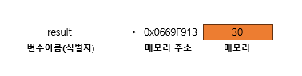

## 4장 변수

### 4.1 변수란 무엇인가? 왜 필요한가?

사람은 계산과 기억을 모두 두뇌에서 하지만, 컴퓨터는 연산과 기억을 수행하는 부품이 나눠져 있다. 컴퓨터는 CPU를 사용해 연산하고, 메모리를 사용해 데이터를 기억한다.
메모리는 데이터를 저장할 수 있는 메모리 셀의 집합체다. 메모리 셀 하나의 크기는 1바이트(8비트)이며, 컴퓨터는 이러한 셀 단위로 데이터를 저장하거나 읽는다.

컴퓨터는 연산을 하고, 그 결과값을 재사용하기 위해서는 결과가 저장된 메모리 공간에 직접 접근하는 것 외에는 방법이 없다.하지만 메모리 주소를 통해 직접 접근하는 것은 치명적 오류를 발생시킬
가능성이 높다. 또한 값이 저장될 메모리 상황에 따라 메모리 주소는 코드가 실행될때마다 변경되기 때문에 메모리 주소를 통해 값에 접근하려는 시도는 올바른 방법이 아니다.
때문에 자바스크립트는 개발자의 직접적인 메모리 제어를 허용하지 않는다.

따라서 **변수란 하나의 값을 저장하기 위해 확보한 메모리 공간 자체 또는 메모리 공간을 식별하기 위해 붙인 이름**을 말한다.

간단히, **값의 위치를 가르키는 상징적인 이름이다.**

### 4.2 식별자

식별자는 어떤 값을 구별해서 식별할 수 있는 고유한 이름을 말한다. 또한 식별자는 값이 아니라 메모리 주소를 기억하고 있다.

</img>

식별자라는 용어는 변수 이름에만 국한해서 사용하지 않고, 메모리 상에 존재하는 어떤 값을 식별할 수 있는 이름은 모두 식별자라고 부른다.
선언하지 않은 식별자에 접근하면 ReferenceError(참조 에러)가 발생한다.

### 4.3 변수 선언

변수 선언이란 변수를 생성하는 것을 말한다. 변수 선언에 의해 확보된 메모리 공간은 확보가 해제되기 전까지는 누구도 확보된 메모리 공간을 사용할 수 없도록 보호되므로 안전하게 사용할 수 있다.  
변수를 사용하려면 반드시 선언이 필요하며, **var, let const**키워드를 사용한다.

> **var의 단점**  
> var 키워드의 여러 단점 중에서 가장 대표적인 것이 [블록 레벨 스코프](https://poiemaweb.com/es6-block-scope)를 지원하지 않고 함수 레벨 스코프를 지원한다는 것이다.
> 이로 인해 의도치 않게 전역 변수가 선언되어 심각한 부작용이 발생하기도 한다.

자바 스크립트 엔진은 변수 선언을 다음과 같은 2단계에 거쳐 수행한다.

- **선언 단계**: 이름을 등록해서 자바스크립트 엔진에 변수의 존재를 알린다.
- **초기화 단계**: 값을 저장하기 위한 메모리 공간을 확보하고 암묵적으로 undefined를 할당해 초기화한다.

> **undefined**  
> undefined는 자바스크립트에서 제공하는 원시 타입의 값이다.

### 4.4 변수 선언의 시점과 변수 호이스팅

**자바 스크립트는 변수 선언이 소스코드가 한 줄씩 순차적으로 실행되는 시점, 즉 런타임이 아니라 그 이전 단계에서 먼저 실행된다.**
즉, 자바스크립트 엔진은 변수 선언이 소스 코드의 어디에 있든 상관없이 다른 코드보다 먼저 실행된다.

이처럼 **변수 선언문이 코드의 선두로 끌어 올려진 것처럼 동작하는 자바스크립트 고유의 특징을 변수 호이스팅**이라 한다.

### 4.5 값의 할당

**변수 선언은 소스코드가 순차적으로 실행되는 시점인 런타임 이전에 먼저 실행되지만 값의 할당은 소스코드가 순차적으로 실행되는 시점인 런타임에 실행된다.**

<pre><code>console.log(score); // undefined

var score; // 변수 선언
score = 80; // 값의 할당

console.log(score) // 80
</code></pre>

<pre><code>console.log(score); // undefined

var score=80; // 변수 선언과 값의 할당

console.log(score) // 80
</code></pre>

그러면

<pre><code>console.log(score); // undefined

score =80 // 값의 할당
var score; // 변수 선언

console.log(score) // ??? 정답은 맨 밑에
</code></pre>

### 4.6 값의 재할당

재할당이란 이미 값이 할당되어 있는 변수에 새로운 값을 또다시 할당하는 것을 말한다.  
만약 **값을 재할당할 수 없어서 변수에 저장된 값을 변경할 수 없다면 변수가 아니라 상수(constant)라** 한다.

재할당은 이전 값이 저장되어 있던 메모리 공간을 지우고 그 메모리 공간에 재할당 값을 새롭게 저장하는 것이 아니라 새로운 메모리 공간을 확보하고 그 메모리 공간에 값을 저장한다.
그리고 사용하지 않게 된 불필요한 이전 값들은 가비지 콜렉터에 의해 메모리에서 자동 해제된다. 단, 메모리에서 언제 해제될지는 예측할 수 없다.

> **가비지 콜렉터**  
> 가비지 콜렉터는 애플리케이션이 할당한 메모리 공간을 주기적으로 검사하여 더 이상 사용되지 않는 메모리를 해제하는 기능을 말한다.

### 4.7 식별자 네이밍 규칙

식별자는 다음과 같은 네이밍 규칙을 준수해야 한다

- 식별자는 특수문자를 제외한 문자, 숫자,언더스코어( \_ ), 달러 기호($)를 포함할 수 있다.
- 단 식별자는 특수문자를 제외한 문자, 언더스코어( \_ ), 달러 기호($)로 시작해야 한다. 숫자로 시작하는 것은 하용하지 않는다.
- 예약어는 식별자로 사용할 수 없다.

> **예약어**  
> 예약어는 프로그래밍 언어에서 사용되고 있거나 사용될 예정인 단어를 말한다.  
> [자바스크립트의 예약어](https://www.w3bai.com/ko/js/js_reserved.html#gsc.tab=0)

ES5부터 식별자를 만들 떄, 유니코드 문자를 허용하므로 알파벳 외의 한글이나 일본어 식별자도 사용할 수 있지만, 바람직하지는 않다.

일반적으로 변수나 함수의 이름에는 카멜 케이스를 사용하고, 클래스의 이름에는 파스칼 케이스를 사용한다.

> **카멜케이스**  
> <code style="color:blue">var camelCase;</code>  
> 중간 글자들은 대문자로 시작하지만 첫 글자가 소문자

> **파스칼 케이스**  
> <code style="color:blue">var PascalCase;</code>  
> 첫 글자와 중간 글자들이 대문자
